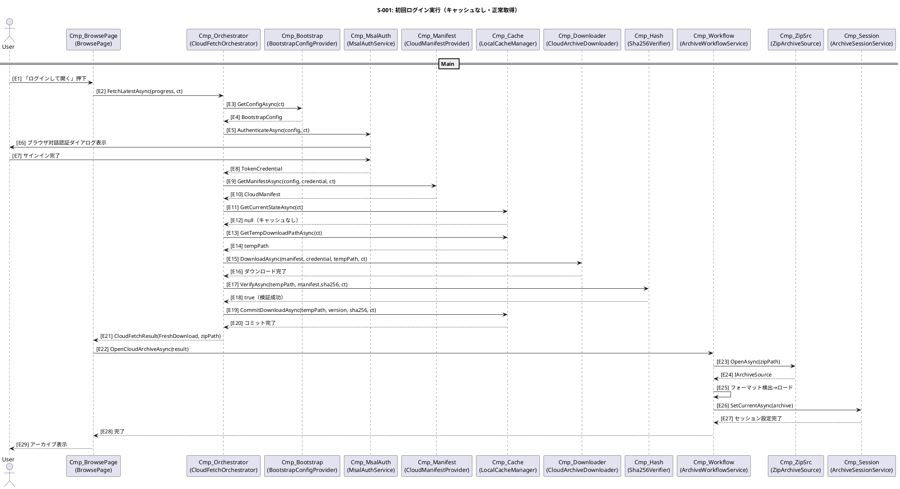
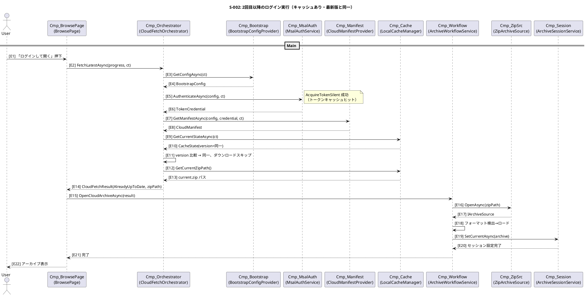
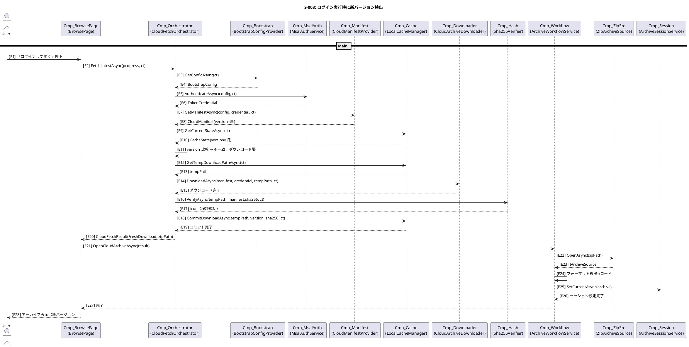
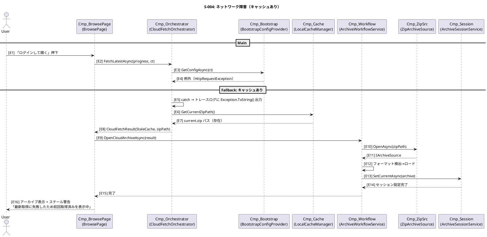
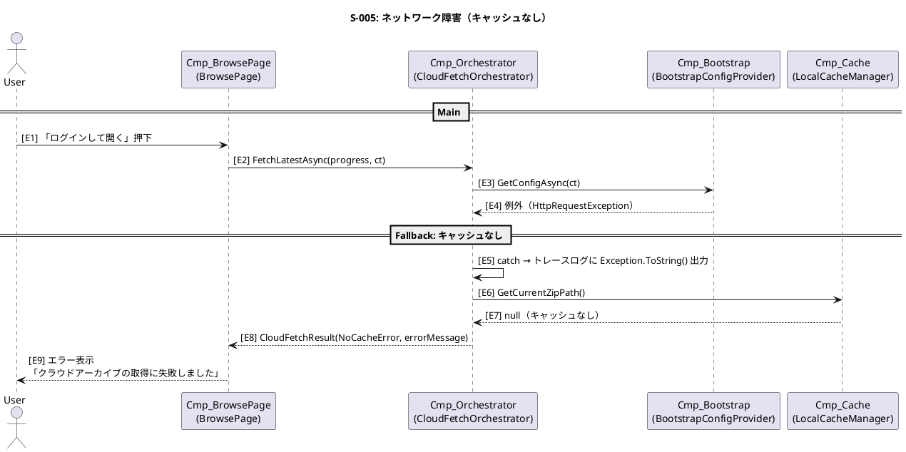
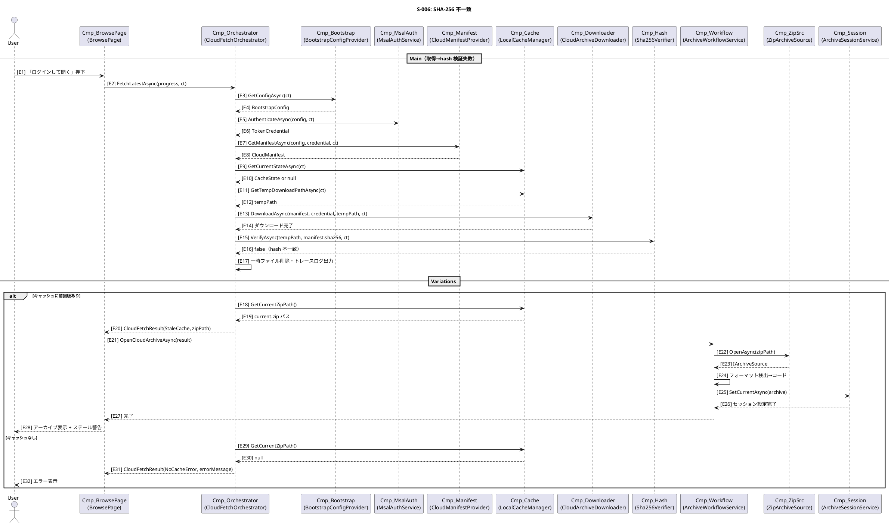
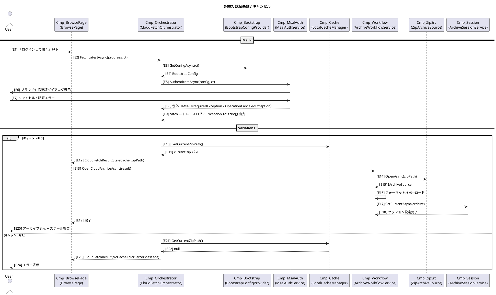
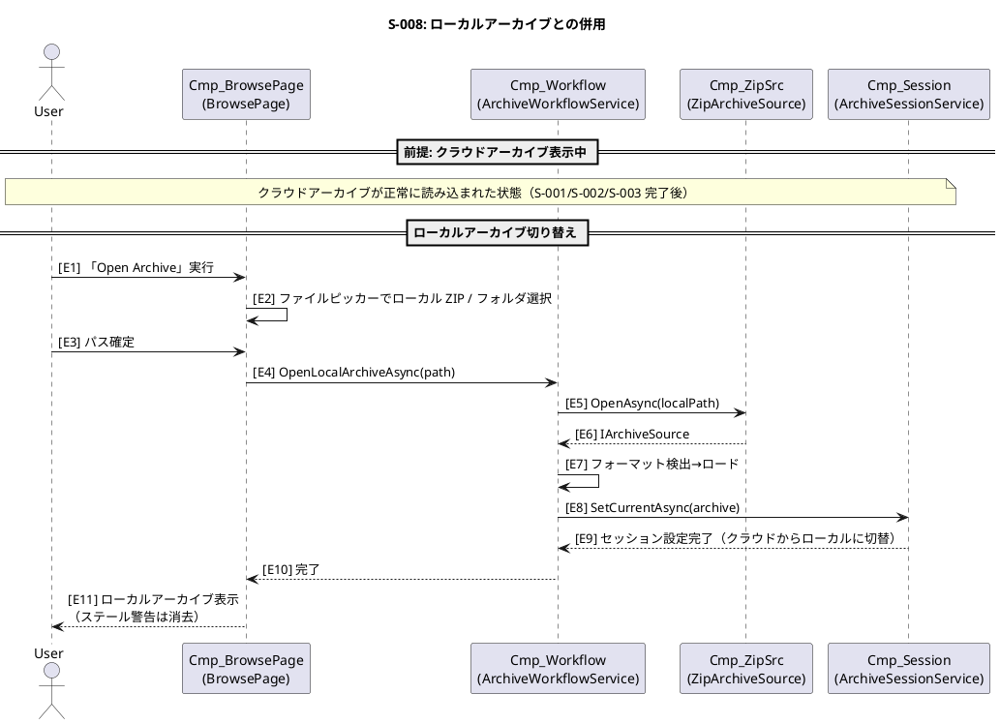

# クラウド配信アーカイブ取得機能 — Runtime Evidence

> 本ドキュメントは [cloud-archive-fetch.md](./cloud-archive-fetch.md) の Runtime Evidence として、主要シナリオの実行時シーケンスとシナリオ台帳を定義する。

---

## C4 Vocabulary（再掲・抜粋）

| ID | Kind | Formal Name | 役割 |
|---|---|---|---|
| Cmp-BrowsePage | Component | BrowsePage | 閲覧画面のエントリアクション（ログインして開く / Open Archive） |
| Cmp-Orchestrator | Component | CloudFetchOrchestrator | クラウド取得のメインオーケストレーション |
| Cmp-Bootstrap | Component | BootstrapConfigProvider | bootstrap.json 取得 |
| Cmp-MsalAuth | Component | MsalAuthService (ICloudAuthService) | MSAL 対話的認証・トークン取得 |
| Cmp-Manifest | Component | CloudManifestProvider | manifest.json 取得 |
| Cmp-Cache | Component | LocalCacheManager (ICacheManager) | ローカルキャッシュ管理 |
| Cmp-Downloader | Component | CloudArchiveDownloader | ZIP ダウンロード |
| Cmp-Hash | Component | Sha256Verifier (IHashVerifier) | SHA-256 検証 |
| Cmp-Workflow | Component | ArchiveWorkflowService | ソース取得→フォーマット検出→ロード→セッション設定→VM 更新 |
| Cmp-ZipSrc | Component | ZipArchiveSource | ZIP 展開・FolderArchiveSource 委譲 |
| Cmp-Session | Component | ArchiveSessionService | アーカイブセッション管理 |

---

## Scenario Details

### Scenario S-001: 初回ログイン実行（キャッシュなし・正常取得）

**Summary:** キャッシュが存在しない状態で「ログインして開く」を実行し、クラウドから ZIP を取得して表示する正常系フロー。
**Participants (C4 IDs):** Cmp-BrowsePage, Cmp-Orchestrator, Cmp-Bootstrap, Cmp-MsalAuth, Cmp-Manifest, Cmp-Cache, Cmp-Downloader, Cmp-Hash, Cmp-Workflow, Cmp-ZipSrc, Cmp-Session

#### Sequence (PlantUML)

#### Component–Step Map

| Component | Steps |
|---|---|
| Cmp-BrowsePage | E1, E22, E29 |
| Cmp-Orchestrator | E2, E4, E8, E10, E12, E14, E16, E18, E20, E21 |
| Cmp-Bootstrap | E3, E4 |
| Cmp-MsalAuth | E5, E6, E7, E8 |
| Cmp-Manifest | E9, E10 |
| Cmp-Cache | E11, E12, E13, E14, E19, E20 |
| Cmp-Downloader | E15, E16 |
| Cmp-Hash | E17, E18 |
| Cmp-Workflow | E22, E23, E25, E26, E28 |
| Cmp-ZipSrc | E23, E24 |
| Cmp-Session | E26, E27 |

---

### Scenario S-002: 2回目以降のログイン実行（キャッシュあり・最新版と同一）

**Summary:** キャッシュ済み ZIP が最新版と同一であり、ダウンロードをスキップしてキャッシュ ZIP を表示する。
**Participants (C4 IDs):** Cmp-BrowsePage, Cmp-Orchestrator, Cmp-Bootstrap, Cmp-MsalAuth, Cmp-Manifest, Cmp-Cache, Cmp-Workflow, Cmp-ZipSrc, Cmp-Session

#### Sequence (PlantUML)

#### Component–Step Map

| Component | Steps |
|---|---|
| Cmp-BrowsePage | E1, E15, E22 |
| Cmp-Orchestrator | E2, E4, E6, E8, E10, E11, E13, E14 |
| Cmp-Bootstrap | E3, E4 |
| Cmp-MsalAuth | E5, E6 |
| Cmp-Manifest | E7, E8 |
| Cmp-Cache | E9, E10, E12, E13 |
| Cmp-Workflow | E15, E16, E18, E19, E21 |
| Cmp-ZipSrc | E16, E17 |
| Cmp-Session | E19, E20 |

---

### Scenario S-003: ログイン実行時に新バージョン検出

**Summary:** キャッシュ済み版とは異なる新バージョンが manifest に存在し、新 ZIP をダウンロードして更新する。
**Participants (C4 IDs):** Cmp-BrowsePage, Cmp-Orchestrator, Cmp-Bootstrap, Cmp-MsalAuth, Cmp-Manifest, Cmp-Cache, Cmp-Downloader, Cmp-Hash, Cmp-Workflow, Cmp-ZipSrc, Cmp-Session

#### Sequence (PlantUML)

#### Component–Step Map

| Component | Steps |
|---|---|
| Cmp-BrowsePage | E1, E21, E28 |
| Cmp-Orchestrator | E2, E4, E6, E8, E10, E11, E13, E15, E17, E19, E20 |
| Cmp-Bootstrap | E3, E4 |
| Cmp-MsalAuth | E5, E6 |
| Cmp-Manifest | E7, E8 |
| Cmp-Cache | E9, E10, E12, E13, E18, E19 |
| Cmp-Downloader | E14, E15 |
| Cmp-Hash | E16, E17 |
| Cmp-Workflow | E21, E22, E24, E25, E27 |
| Cmp-ZipSrc | E22, E23 |
| Cmp-Session | E25, E26 |

---

### Scenario S-004: ネットワーク障害（キャッシュあり）

**Summary:** bootstrap.json 取得時にネットワークエラーが発生するが、前回取得済みキャッシュで表示を継続する。ステール警告を表示。
**Participants (C4 IDs):** Cmp-BrowsePage, Cmp-Orchestrator, Cmp-Bootstrap, Cmp-Cache, Cmp-Workflow, Cmp-ZipSrc, Cmp-Session

#### Sequence (PlantUML)

#### Component–Step Map

| Component | Steps |
|---|---|
| Cmp-BrowsePage | E1, E9, E16 |
| Cmp-Orchestrator | E2, E4, E5, E7, E8 |
| Cmp-Bootstrap | E3, E4 |
| Cmp-Cache | E6, E7 |
| Cmp-Workflow | E9, E10, E12, E13, E15 |
| Cmp-ZipSrc | E10, E11 |
| Cmp-Session | E13, E14 |

---

### Scenario S-005: ネットワーク障害（キャッシュなし）

**Summary:** bootstrap.json 取得時にネットワークエラーが発生し、キャッシュも存在しないためエラー表示のみ。
**Participants (C4 IDs):** Cmp-BrowsePage, Cmp-Orchestrator, Cmp-Bootstrap, Cmp-Cache

#### Sequence (PlantUML)

#### Component–Step Map

| Component | Steps |
|---|---|
| Cmp-BrowsePage | E1, E9 |
| Cmp-Orchestrator | E2, E4, E5, E7, E8 |
| Cmp-Bootstrap | E3, E4 |
| Cmp-Cache | E6, E7 |

---

### Scenario S-006: SHA-256 不一致

**Summary:** ZIP ダウンロード完了後に SHA-256 検証が失敗する。キャッシュ有無によりフォールバックまたはエラーに分岐する。
**Participants (C4 IDs):** Cmp-BrowsePage, Cmp-Orchestrator, Cmp-Bootstrap, Cmp-MsalAuth, Cmp-Manifest, Cmp-Cache, Cmp-Downloader, Cmp-Hash, Cmp-Workflow, Cmp-ZipSrc, Cmp-Session

#### Sequence (PlantUML)

#### Component–Step Map

| Component | Steps |
|---|---|
| Cmp-BrowsePage | E1, E21/E28/E32 |
| Cmp-Orchestrator | E2, E4, E6, E8, E10, E12, E14, E16, E17, E18–E20/E29–E31 |
| Cmp-Bootstrap | E3, E4 |
| Cmp-MsalAuth | E5, E6 |
| Cmp-Manifest | E7, E8 |
| Cmp-Cache | E9, E10, E11, E12, E18, E19/E29, E30 |
| Cmp-Downloader | E13, E14 |
| Cmp-Hash | E15, E16 |
| Cmp-Workflow | E21, E22, E24, E25, E27 |
| Cmp-ZipSrc | E22, E23 |
| Cmp-Session | E25, E26 |

---

### Scenario S-007: 認証失敗 / キャンセル

**Summary:** MSAL 対話認証でユーザーがキャンセルまたは認証エラーが発生する。キャッシュ有無によりフォールバックまたはエラーに分岐する。
**Participants (C4 IDs):** Cmp-BrowsePage, Cmp-Orchestrator, Cmp-Bootstrap, Cmp-MsalAuth, Cmp-Cache, Cmp-Workflow, Cmp-ZipSrc, Cmp-Session

#### Sequence (PlantUML)

#### Component–Step Map

| Component | Steps |
|---|---|
| Cmp-BrowsePage | E1, E13/E20/E24 |
| Cmp-Orchestrator | E2, E4, E8, E9, E10–E12/E21–E23 |
| Cmp-Bootstrap | E3, E4 |
| Cmp-MsalAuth | E5, E6, E7, E8 |
| Cmp-Cache | E10, E11/E21, E22 |
| Cmp-Workflow | E13, E14, E16, E17, E19 |
| Cmp-ZipSrc | E14, E15 |
| Cmp-Session | E17, E18 |

---

### Scenario S-008: ローカルアーカイブとの併用

**Summary:** クラウドアーカイブ表示中にユーザーが手動で「Open Archive」を実行し、ローカルアーカイブに切り替える。
**Participants (C4 IDs):** Cmp-BrowsePage, Cmp-Workflow, Cmp-ZipSrc, Cmp-Session

#### Sequence (PlantUML)

#### Component–Step Map

| Component | Steps |
|---|---|
| Cmp-BrowsePage | E1, E2, E3, E11 |
| Cmp-Workflow | E4, E5, E7, E8, E10 |
| Cmp-ZipSrc | E5, E6 |
| Cmp-Session | E8, E9 |

---

## Scenario Ledger（シナリオ台帳）

| Scenario ID | 目的/価値（1行） | Given（前提） | When（トリガ） | Then（結果） | 参加者（Vocabulary ID） | 入出力/メッセージ | 例外・タイムアウト・リトライ | 観測点（ログ/メトリクス） |
|---|---|---|---|---|---|---|---|---|
| S-001 | 初回ログイン実行で ZIP を取得し表示 | キャッシュなし | 「ログインして開く」押下 | ZIP ダウンロード→検証→cache 保存→ビューア表示 | Cmp-BrowsePage, Cmp-Orchestrator, Cmp-Bootstrap, Cmp-MsalAuth, Cmp-Manifest, Cmp-Cache, Cmp-Downloader, Cmp-Hash, Cmp-Workflow, Cmp-ZipSrc, Cmp-Session | bootstrap.json→認証→manifest.json→ZIP / アーカイブ表示 | 各段階で例外→S-004/S-005/S-006/S-007 に分岐 | ログ: bootstrap 取得, 認証成功, manifest 取得, ダウンロード完了, hash 検証成功, cache コミット |
| S-002 | キャッシュヒットでスキップ表示 | キャッシュあり・version 同一 | 「ログインして開く」押下 | ダウンロードスキップ→キャッシュ ZIP でビューア表示 | Cmp-BrowsePage, Cmp-Orchestrator, Cmp-Bootstrap, Cmp-MsalAuth, Cmp-Manifest, Cmp-Cache, Cmp-Workflow, Cmp-ZipSrc, Cmp-Session | manifest.version == cache.version / AlreadyUpToDate | - | ログ: version 一致・スキップ |
| S-003 | 新 version の ZIP を更新取得 | キャッシュあり・version 不一致 | 「ログインして開く」押下 | 新 ZIP ダウンロード→検証→cache 更新→ビューア表示 | Cmp-BrowsePage, Cmp-Orchestrator, Cmp-Bootstrap, Cmp-MsalAuth, Cmp-Manifest, Cmp-Cache, Cmp-Downloader, Cmp-Hash, Cmp-Workflow, Cmp-ZipSrc, Cmp-Session | manifest.version != cache.version / FreshDownload | hash 不一致→S-006 に分岐 | ログ: version 不一致, ダウンロード開始, 更新完了 |
| S-004 | ネットワーク障害時のキャッシュフォールバック | キャッシュあり | 「ログインして開く」押下・bootstrap 取得失敗 | 前回キャッシュで表示 + ステール警告 | Cmp-BrowsePage, Cmp-Orchestrator, Cmp-Bootstrap, Cmp-Cache, Cmp-Workflow, Cmp-ZipSrc, Cmp-Session | HttpRequestException / StaleCache | 例外 catch→トレースログ出力→キャッシュ使用 | ログ: bootstrap 取得失敗(Exception.ToString()), フォールバック実行, ステール警告 |
| S-005 | ネットワーク障害＋キャッシュなし→エラー | キャッシュなし | 「ログインして開く」押下・bootstrap 取得失敗 | エラー表示 | Cmp-BrowsePage, Cmp-Orchestrator, Cmp-Bootstrap, Cmp-Cache | HttpRequestException / NoCacheError | 例外 catch→トレースログ出力→エラー返却 | ログ: bootstrap 取得失敗(Exception.ToString()), NoCacheError |
| S-006 | SHA-256 不一致でダウンロード破棄 | ZIP ダウンロード完了 | hash 検証失敗 | 一時ファイル削除→キャッシュ有無で分岐 | Cmp-BrowsePage, Cmp-Orchestrator, Cmp-Bootstrap, Cmp-MsalAuth, Cmp-Manifest, Cmp-Cache, Cmp-Downloader, Cmp-Hash, Cmp-Workflow, Cmp-ZipSrc, Cmp-Session | hash mismatch / StaleCache or NoCacheError | 一時ファイル削除→トレースログ出力 | ログ: hash 不一致(期待値/実値), 一時ファイル削除 |
| S-007 | 認証失敗/キャンセルでの分岐 | bootstrap 取得成功 | 「ログインして開く」押下後の MSAL 認証キャンセル/エラー | キャッシュ有無で分岐 | Cmp-BrowsePage, Cmp-Orchestrator, Cmp-Bootstrap, Cmp-MsalAuth, Cmp-Cache, Cmp-Workflow, Cmp-ZipSrc, Cmp-Session | MsalUiRequiredException or OperationCanceledException / StaleCache or NoCacheError | 例外 catch→トレースログ出力→キャッシュ有無で分岐 | ログ: 認証失敗(Exception.ToString()), フォールバック or NoCacheError |
| S-008 | ローカルアーカイブへの手動切り替え | クラウドアーカイブ表示中 | 「Open Archive」実行 | ローカルアーカイブに切り替わる | Cmp-BrowsePage, Cmp-Workflow, Cmp-ZipSrc, Cmp-Session | ローカルパス / アーカイブ切替表示 | ファイルピッカーキャンセル→操作中止 | ログ: ローカルアーカイブ切替 |
