# v1 初版リリース — Runtime Evidence

> 本ドキュメントは [v1-initial-release.md](./v1-initial-release.md) の Runtime Evidence として、主要シナリオの実行時シーケンスとシナリオ台帳を定義する。

---

## C4 Vocabulary（再掲・抜粋）

| ID | Kind | Formal Name | 役割 |
|---|---|---|---|
| M-Shell | Component | AppShell | メインウインドウ・ナビゲーション |
| M-NavSvc | Component | NavigationService | ページ遷移 |
| M-OpenSvc | Component | ArchiveOpenService | アーカイブオープン |
| M-FormatReg | Component | FormatRegistry | 形式登録・検出 |
| M-LoadSvc | Component | ArchiveLoadService | 読み込みオーケストレーション |
| M-ZipSrc | Component | ZipArchiveSource | ZIP 入力ソース |
| M-FolderSrc | Component | FolderArchiveSource | フォルダ入力ソース |
| M-SlackFmt | Component | SlackFormatProvider | Slack 形式検出・パース |
| M-DateFilter | Component | DateFilterService | 日付フィルタ |
| M-Search | Component | SearchService | キーワード検索 |
| M-OverviewVM | Component | ArchiveOverviewVM | 概要情報 VM |
| M-BrowseVM | Component | ArchiveBrowseVM | list/details 閲覧 VM |
| M-MsgListVM | Component | MessageListVM | メッセージ一覧 VM |
| M-SearchVM | Component | SearchVM | 検索 VM |
| M-AboutVM | Component | AboutVM | About 画面 VM |
| M-SettingsVM | Component | SettingsVM | 設定画面 VM |
| X-Picker | External | WindowsFilePicker | OS ファイルピッカー |
| X-FS | External | FileSystem | ファイルシステム |
| X-Browser | External | DefaultBrowser | ブラウザ |
| X-TempDir | External | TempDirectory | 一時ディレクトリ |

---

## Scenario Ledger（シナリオ台帳）

| Scenario ID | Purpose | Given | When | Then | Participants | Input/Output | Exception/Timeout/Retry | Observation Points |
|---|---|---|---|---|---|---|---|---|
| S-010 | アプリ起動（初期状態） | アプリ未起動 | ユーザーがアプリを起動 | WelcomePage が表示される | M-Shell, M-NavSvc | -/WelcomePage | - | ログ: アプリ起動 |
| S-020 | ZIP アーカイブを開いて閲覧 | アプリ起動済み・アーカイブ未読み込み | ユーザーが ZIP ファイルを選択 | アーカイブが読み込まれ ArchiveBrowsePage に遷移 | M-Shell, M-OpenSvc, M-ZipSrc, M-FormatReg, M-SlackFmt, M-LoadSvc, M-OverviewVM, X-Picker, X-TempDir | ZIP パス / ChatArchive | ZIP 展開失敗→ErrorDialog, 形式検出失敗→ErrorDialog | ログ: ファイル数, チャンネル数, メッセージ数 |
| S-030 | フォルダアーカイブを開いて閲覧 | アプリ起動済み | ユーザーがフォルダを選択 | アーカイブが読み込まれ ArchiveBrowsePage に遷移 | M-Shell, M-OpenSvc, M-FolderSrc, M-FormatReg, M-SlackFmt, M-LoadSvc, M-OverviewVM, X-Picker | フォルダパス / ChatArchive | 形式検出失敗→ErrorDialog | ログ: ファイル数, チャンネル数, メッセージ数 |
| S-040 | チャンネル選択と日付選択（list/details） | アーカイブ読み込み済み | ユーザーがチャンネル一覧でチャンネルを選び、日付を選択 | 選択チャンネル・日付のメッセージがコンテンツ領域に表示される。BreadcrumbBar が更新される | M-BrowseVM, M-DateFilter, M-NavSvc | チャンネル+日付選択 / メッセージ一覧 | - | - |
| S-050 | メッセージ一覧のチャット風表示 | チャンネル・日付選択済み | コンテンツ領域にメッセージが表示される | メッセージがチャット風に時系列表示される | M-MsgListVM, M-SlackFmt, M-BrowseVM | チャンネルID+日付 / メッセージ一覧 | メッセージ読み込み失敗→診断表示 | ログ: メッセージ数 |
| S-055 | アダプティブレイアウト切り替え | ArchiveBrowsePage 表示中 | ウインドウ幅を変更 | 広い画面では 3 カラム同時表示、狭い画面では drill-down 型に切り替わる | M-BrowseVM, M-Shell | 画面幅変更 / レイアウト変更 | - | - |
| S-060 | キーワード検索 | アーカイブ読み込み済み | ユーザーがキーワードを入力し検索 | マッチするメッセージが一覧表示される | M-SearchVM, M-Search, M-SlackFmt | 検索キーワード / 検索結果 | 検索対象なし→空結果表示。空文字列は UI 上で検索実行不可（操作無効化） | ログ: 検索ヒット数 |
| S-070 | About 画面表示 | アプリ起動済み | ユーザーが About を選択 | About 情報が表示される | M-AboutVM, M-NavSvc | - / About 情報 | - | - |
| S-080 | プライバシーポリシー URL を開く | About 画面表示中 | ユーザーがプライバシーポリシーリンクをクリック | デフォルトブラウザで URL が開く | M-AboutVM, X-Browser | - / URL 起動 | URL 未設定→リンク非活性 | - |
| S-085 | テーマ設定の変更 | Settings 画面表示中 | ユーザーがテーマを変更する | テーマが即時反映され、再起動後も保持される | M-SettingsVM, M-Shell | テーマ選択 / テーマ反映 | 保存失敗→ErrorDialog | ログ: テーマ変更 |
| S-110 | 破損ファイルを含むアーカイブの読み込み | アプリ起動済み | 破損 JSON を含む Slack アーカイブを開く | 読み込み可能な部分が表示され、診断に破損情報が記録される | M-LoadSvc, M-SlackFmt, M-OverviewVM | 破損アーカイブ / 部分 ChatArchive + LoadDiagnostic | JSON パース失敗→診断記録・継続 | ログ: 破損ファイルパス（データ内容除く） |
| S-120 | 読み込みキャンセル | 読み込み中 | ユーザーがキャンセルを押下 | 読み込みが中止され WelcomePage に戻る | M-LoadSvc, M-Shell | CancellationToken | OperationCanceledException→正常中止 | ログ: キャンセル記録 |
| S-130 | 未対応形式のアーカイブを開く | アプリ起動済み | 未対応形式のフォルダを開く | 形式不明エラーが表示される | M-FormatReg, M-OpenSvc | フォルダパス / エラーメッセージ | 全形式検出失敗→ErrorDialog | ログ: 検出試行結果 |
| S-140 | 空チャンネル・空日付の取り扱い | アーカイブ読み込み済み | 空チャンネルや空日付を含むアーカイブ | 空チャンネルも一覧に表示。空日付は選択肢に出ない | M-SlackFmt, M-BrowseVM | 空データアーカイブ / 一覧（空含む） | - | - |

---

## Scenario Details

### Scenario S-010: アプリ起動（初期状態）

#### Sequence (PlantUML)

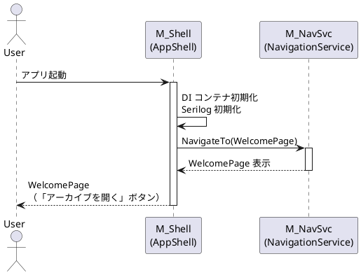

#### Component–Step Map

| Step | M-Shell | M-NavSvc |
|---|---|---|
| 1. アプリ起動 | ● | |
| 2. DI・ログ初期化 | ● | |
| 3. WelcomePage へ遷移 | | ● |

---

### Scenario S-020: ZIP アーカイブを開いて閲覧

#### Sequence (PlantUML)

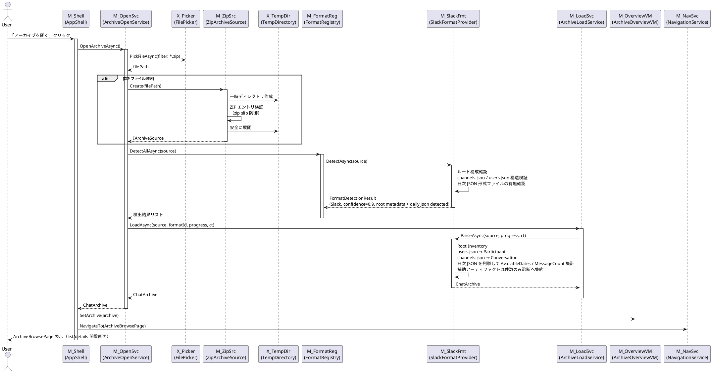

#### Component–Step Map

| Step | M-Shell | M-OpenSvc | X-Picker | M-ZipSrc | X-TempDir | M-FormatReg | M-SlackFmt | M-LoadSvc | M-OverviewVM | M-NavSvc |
|---|---|---|---|---|---|---|---|---|---|---|
| 1. ユーザー操作 | ● | | | | | | | | | |
| 2. ファイルピッカー表示 | | ● | ● | | | | | | | |
| 3. ZIP 展開（安全検証） | | | | ● | ● | | | | | |
| 4. 形式自動検出 | | | | | | ● | ● | | | |
| 5. アーカイブパース | | | | | | | ● | ● | | |
| 6. 閲覧画面へ遷移 | ● | | | | | | | | ● | ● |

---

### Scenario S-030: フォルダアーカイブを開いて閲覧

#### Sequence (PlantUML)

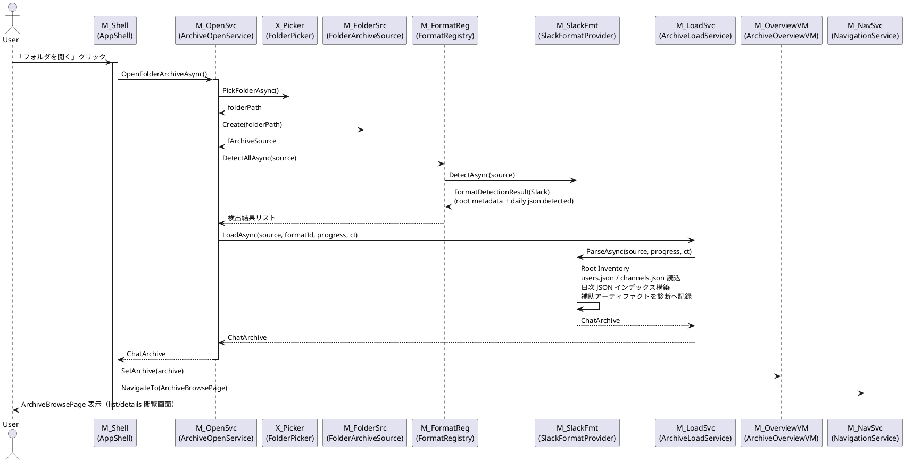

#### Component–Step Map

| Step | M-Shell | M-OpenSvc | X-Picker | M-FolderSrc | M-FormatReg | M-SlackFmt | M-LoadSvc | M-OverviewVM | M-NavSvc |
|---|---|---|---|---|---|---|---|---|---|
| 1. ユーザー操作 | ● | | | | | | | | |
| 2. フォルダピッカー表示 | | ● | ● | | | | | | |
| 3. フォルダソース生成 | | | | ● | | | | | |
| 4. 形式自動検出 | | | | | ● | ● | | | |
| 5. アーカイブパース | | | | | | ● | ● | | |
| 6. 閲覧画面へ遷移 | ● | | | | | | | ● | ● |

---

### Scenario S-040: チャンネル選択と日付選択（list/details）

#### Sequence (PlantUML)

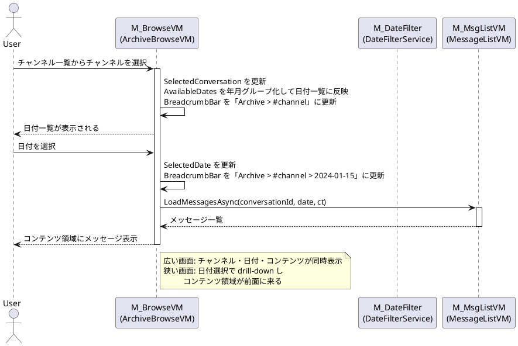

#### Component–Step Map

| Step | M-BrowseVM | M-DateFilter | M-MsgListVM |
|---|---|---|---|
| 1. チャンネル選択 | ● | | |
| 2. 日付一覧更新 | ● | ● | |
| 3. 日付選択 | ● | | |
| 4. メッセージ読み込み | | | ● |
| 5. BreadcrumbBar 更新 | ● | | |

---

### Scenario S-050: メッセージ一覧のチャット風表示

#### Sequence (PlantUML)

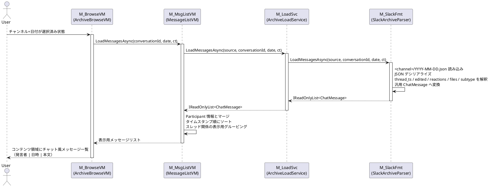

#### Component–Step Map

| Step | M-BrowseVM | M-MsgListVM | M-LoadSvc | M-SlackFmt |
|---|---|---|---|---|
| 1. メッセージ読み込み要求 | ● | ● | | |
| 2. Slack JSON パース | | | ● | ● |
| 3. 表示用データ構成 | | ● | | |
| 4. コンテンツ領域更新 | ● | | | |

---

### Scenario S-055: アダプティブレイアウト切り替え

#### Sequence (PlantUML)

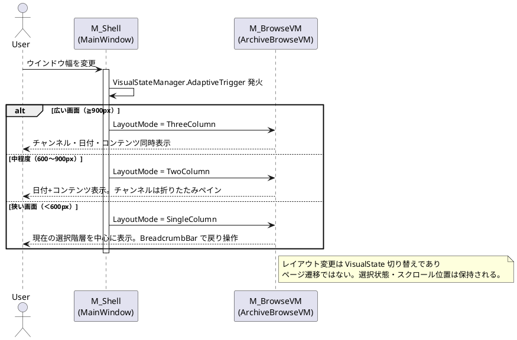

#### Component–Step Map

| Step | M-Shell | M-BrowseVM |
|---|---|---|
| 1. ウインドウ幅変更検出 | ● | |
| 2. VisualState 切り替え | ● | |
| 3. レイアウトモード適用 | | ● |

---

### Scenario S-060: キーワード検索

#### Sequence (PlantUML)

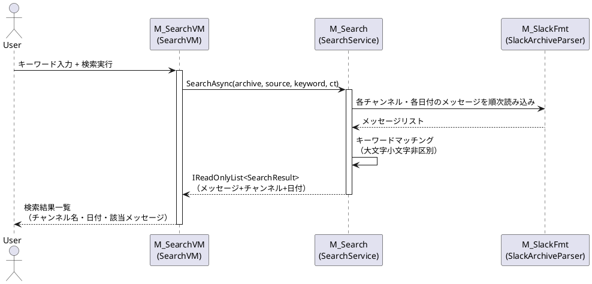

#### Component–Step Map

| Step | M-SearchVM | M-Search | M-SlackFmt |
|---|---|---|---|
| 1. 検索開始 | ● | | |
| 2. メッセージ走査 | | ● | ● |
| 3. マッチング | | ● | |
| 4. 結果表示 | ● | | |

---

### Scenario S-070: About 画面表示

#### Sequence (PlantUML)

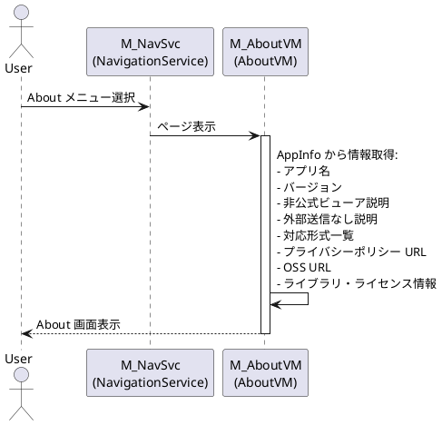

#### Component–Step Map

| Step | M-NavSvc | M-AboutVM |
|---|---|---|
| 1. ナビゲーション | ● | |
| 2. 情報取得・表示 | | ● |

---

### Scenario S-080: プライバシーポリシー URL を開く

#### Sequence (PlantUML)

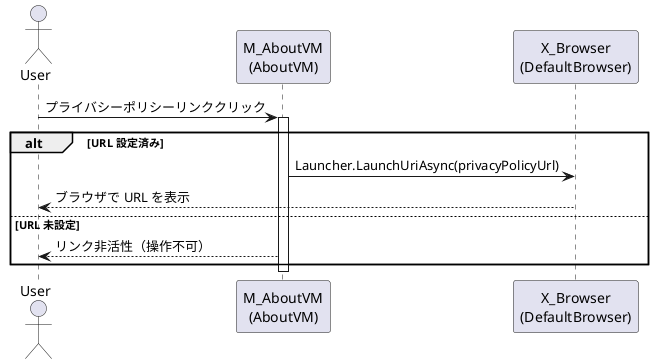

#### Component–Step Map

| Step | M-AboutVM | X-Browser |
|---|---|---|
| 1. リンク押下判定 | ● | |
| 2. URL 起動 | | ● |

---

### Scenario S-085: テーマ設定の変更

#### Sequence (PlantUML)

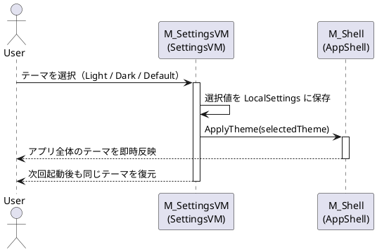

#### Component–Step Map

| Step | M-SettingsVM | M-Shell |
|---|---|---|
| 1. テーマ選択 | ● | |
| 2. 設定保存 | ● | |
| 3. 即時反映 | | ● |
| 4. 次回起動への永続化 | ● | |

---

### Scenario S-110: 破損ファイルを含むアーカイブの読み込み

#### Sequence (PlantUML)

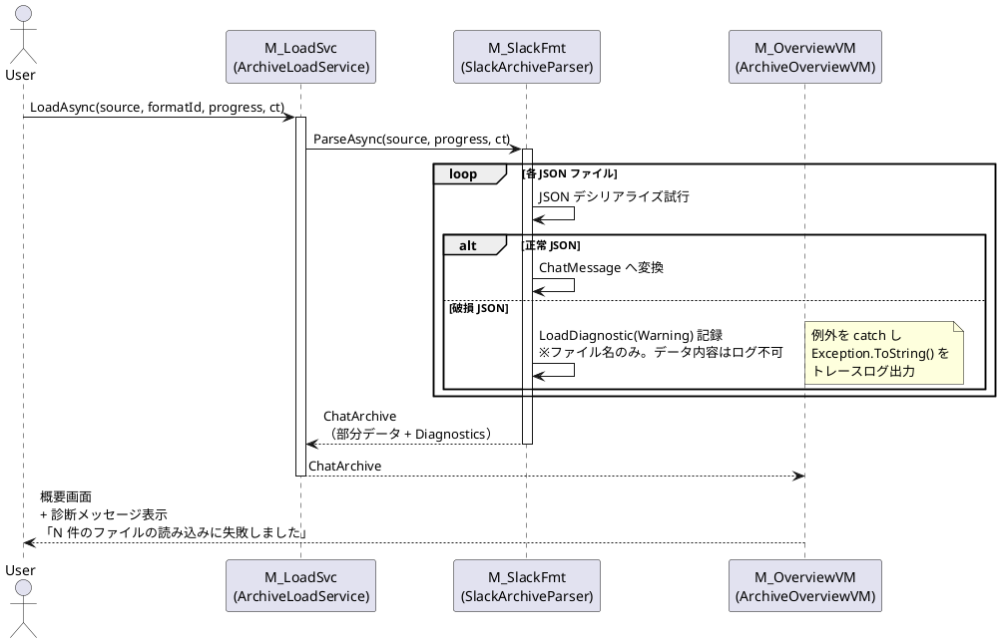

#### Component–Step Map

| Step | M-LoadSvc | M-SlackFmt | M-OverviewVM |
|---|---|---|---|
| 1. 読み込み開始 | ● | | |
| 2. 各ファイルパース | | ● | |
| 3. 破損検出・診断記録 | | ● | |
| 4. 部分結果返却 | ● | | |
| 5. 診断表示 | | | ● |

---

### Scenario S-120: 読み込みキャンセル

#### Sequence (PlantUML)

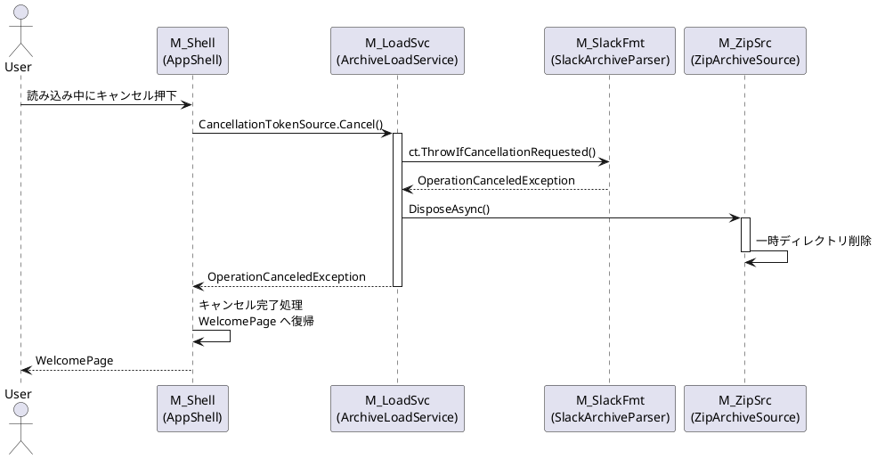

#### Component–Step Map

| Step | M-Shell | M-LoadSvc | M-SlackFmt | M-ZipSrc |
|---|---|---|---|---|
| 1. キャンセル要求 | ● | | | |
| 2. トークン確認・例外 | | ● | ● | |
| 3. リソースクリーンアップ | | | | ● |
| 4. 画面復帰 | ● | | | |

---

### Scenario S-130: 未対応形式のアーカイブを開く

#### Sequence (PlantUML)

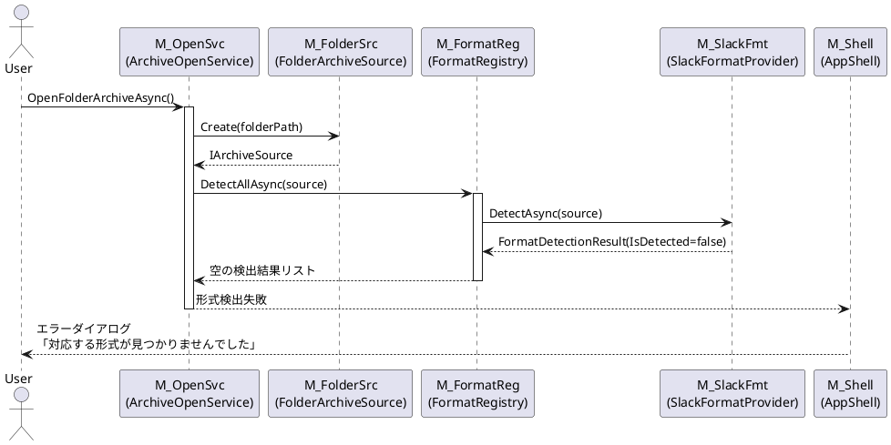

#### Component–Step Map

| Step | M-OpenSvc | M-FolderSrc | M-FormatReg | M-SlackFmt | M-Shell |
|---|---|---|---|---|---|
| 1. フォルダオープン | ● | ● | | | |
| 2. 形式検出（全プロバイダ） | | | ● | ● | |
| 3. 検出失敗判定 | ● | | | | |
| 4. エラー表示 | | | | | ● |

---

### Scenario S-140: 空チャンネル・空日付の取り扱い

#### Sequence (PlantUML)

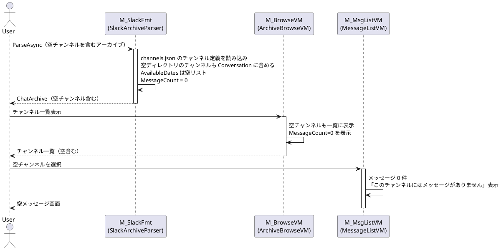

#### Component–Step Map

| Step | M-SlackFmt | M-BrowseVM | M-MsgListVM |
|---|---|---|---|
| 1. 空チャンネルのパース | ● | | |
| 2. 一覧での空表示 | | ● | |
| 3. 空メッセージ表示 | | | ● |
